

# 🫀 Práctica 05 — Generación de Dataset de Pacientes para Riesgo de Infarto Cardíaco en Puebla

**Materia:** Extracción de Conocimiento de Bases de Datos
**Docente:** M.T.I. Marco A. Ramírez Hernández
**Estudiante:** Jenny · **Matrícula:** 230317
**Periodo:** Mayo – Agosto 2026 · Unidad 2 · 9°A IDGS

---

## 📑 Contenido

- [🎯 Objetivo](#-objetivo)
- [🗂️ Contexto del dataset](#️-contexto-del-dataset)
- [🧬 Atributos del dataset](#-atributos-del-dataset)
- [🔍 Desarrollo del notebook](#-desarrollo-del-notebook)
- [📊 Visualizaciones EDA](#-visualizaciones-eda)
- [❤️ Distribución del riesgo cardiovascular](#️-distribución-del-riesgo-cardiovascular)
- [✅ Evidencias entregadas](#-evidencias-entregadas)

---

## 🎯 Objetivo

> Generar de manera individual un dataset clínico **simulado** con información de **5,000 pacientes** del estado de Puebla, como base para prácticas posteriores de clasificación, visualización y análisis supervisado.

Los datos son ficticios y tienen fines exclusivamente académicos; no se utilizó información real ni sensible de pacientes.

## 🗂️ Contexto del dataset

| Aspecto | Descripción |
|---|---|
| Tipo de datos | Clínicos, demográficos, geográficos y de estilo de vida |
| Población simulada | 5,000 pacientes generales del estado de Puebla |
| Variable objetivo | `riesgo_cardiovascular` — Bajo / Medio / Alto |
| Alcance geográfico | 17 municipios y 2 zonas (urbana/rural) del estado de Puebla |
| Fuente | Dataset generado con `dataset_riesgo_infarto_puebla.csv`, con reglas de rango clínico definidas para cada variable |

## 🧬 Atributos del dataset

<b>Ver columnas del dataset (33 columnas en total)</b>

| Categoría | Columnas |
|---|---|
| Identificación | `id_paciente`, `fecha_registro` |
| Demográficos | `edad`, `sexo`, `municipio`, `zona`, `nivel_socioeconomico`, `escolaridad`, `ocupacion`, `seguridad_social` |
| Antropométricos | `peso_kg`, `estatura_cm`, `imc`, `imc_categoria` |
| Signos vitales | `presion_sistolica`, `presion_diastolica`, `frecuencia_cardiaca`, `saturacion_oxigeno` |
| Laboratorio | `glucosa_ayunas_mgdl`, `colesterol_total_mgdl`, `hdl_mgdl`, `ldl_mgdl`, `trigliceridos_mgdl` |
| Estilo de vida y clínicos adicionales | `actividad_fisica`, `tabaquismo`, `consumo_alcohol`, `dieta_calidad`, `horas_sueno`, `estres_percibido_1_10`, `antecedentes_familiares_cardiacos`, `diabetes_diagnosticada`, `hipertension_diagnosticada` |
| Variable objetivo | `riesgo_cardiovascular` (Bajo / Medio / Alto) |

---

## 🔍 Desarrollo del notebook

> Cada punto corresponde a una sección del notebook `Practica05_230317.ipynb`, en el orden en que fueron ejecutadas.

### 1. Carga del dataset e importación de librerías
Se importan `pandas`, `numpy`, `seaborn` y `matplotlib`, se configura el tema visual con `sns.set_theme(style="whitegrid")` y se carga el dataset generado desde `dataset_riesgo_infarto_puebla.csv` en un DataFrame de pandas.

### 2. Verificar las dimensiones del dataset
Se confirma con `df.shape` que el dataset contiene efectivamente **5,000 registros y 33 columnas**, validando que la generación del archivo CSV coincide con el alcance definido en la práctica.

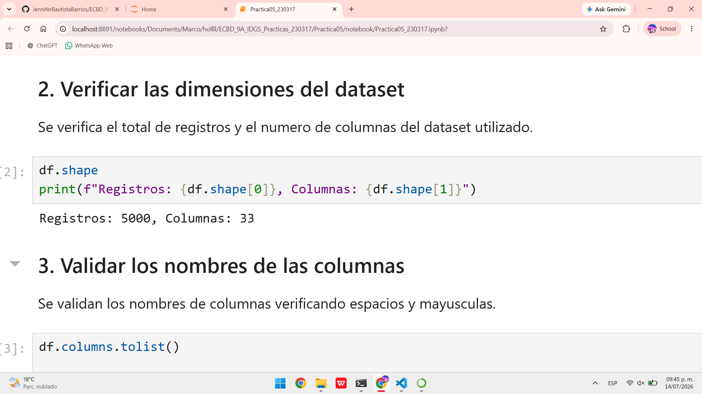

### 3. Validar los nombres de las columnas
Se recorre cada columna verificando que no contenga espacios ni letras mayúsculas, para garantizar nombres consistentes en formato `snake_case`. No se imprimió ningún nombre inválido, por lo que las 33 columnas cumplen el formato esperado.

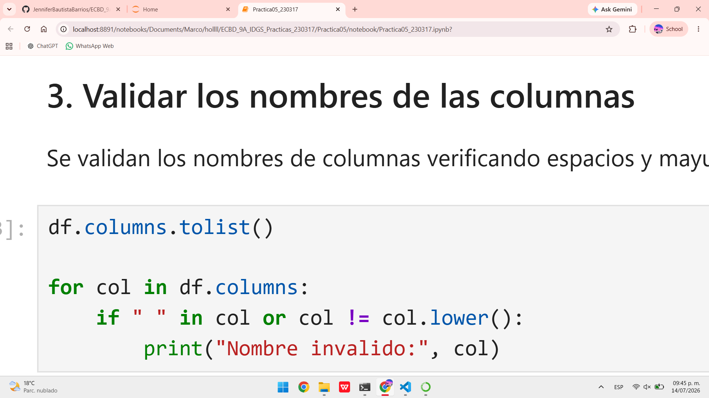

### 4. Verificar los tipos de datos
Se revisan los tipos de dato con `df.dtypes` y `df.info()`. La columna `fecha_registro` se convierte a `datetime`, y 13 columnas categóricas (`sexo`, `municipio`, `zona`, `nivel_socioeconomico`, `escolaridad`, `ocupacion`, `seguridad_social`, `imc_categoria`, `actividad_fisica`, `tabaquismo`, `consumo_alcohol`, `dieta_calidad`, `riesgo_cardiovascular`) se convierten al tipo `category` para optimizar memoria y facilitar el análisis posterior.

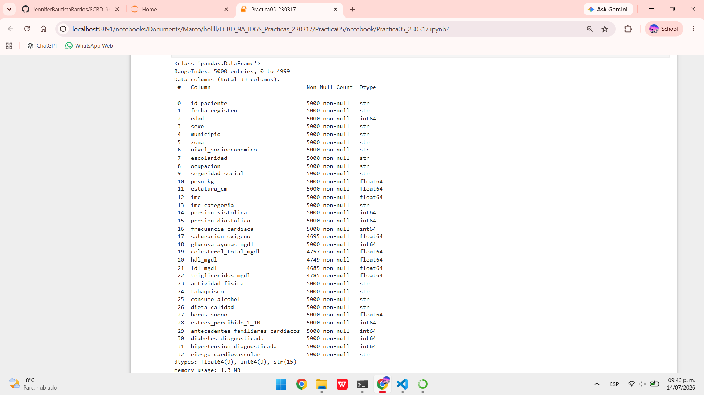

### 5. Buscar valores nulos
Se identifican valores nulos únicamente en las columnas de laboratorio: `saturacion_oxigeno` (305 registros, 6.10%), `colesterol_total_mgdl` (243, 4.86%), `hdl_mgdl` (251, 5.02%), `ldl_mgdl` (315, 6.30%) y `trigliceridos_mgdl` (215, 4.30%). Estos nulos fueron introducidos deliberadamente para simular la falta de resultados de laboratorio que ocurre en datos clínicos reales.

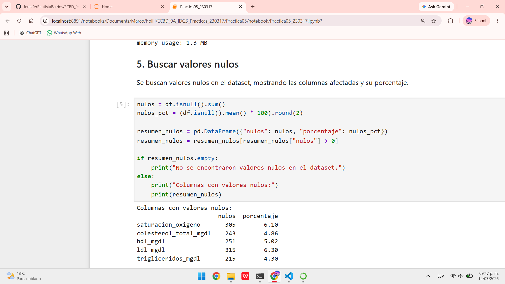

### 6. Buscar registros duplicados
Se verifica que no existan filas completamente duplicadas ni pacientes repetidos según `id_paciente`. El resultado confirma **0 registros duplicados** (DataFrame vacío de `0 rows × 33 columns` al filtrar duplicados).

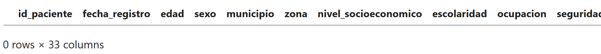

### 7. Validar rangos clínicos
Se comparan los valores de cada variable clínica (edad, peso, estatura, IMC, presión arterial, frecuencia cardiaca, saturación de oxígeno, glucosa, colesterol, HDL, LDL y triglicéridos) contra los rangos médicamente válidos definidos previamente. El resultado confirma **0 valores fuera de rango** en todas las variables.

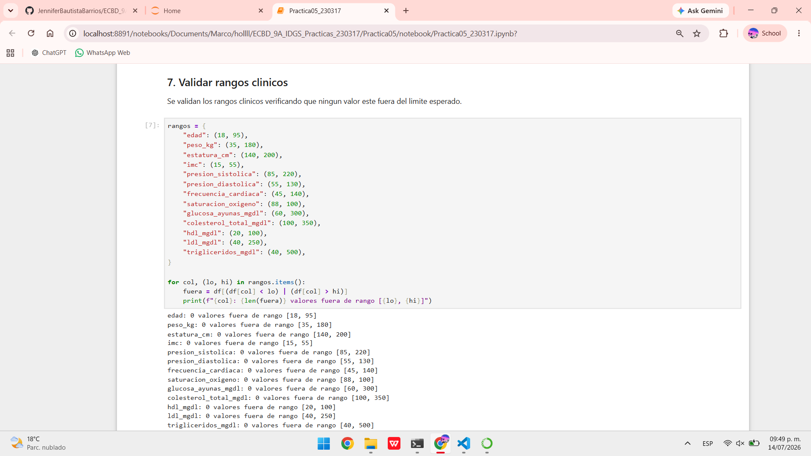

### 8. Validar datos geográficos
Se valida que los 17 municipios registrados (Puebla, Tehuacán, San Martín Texmelucan, Atlixco, San Pedro Cholula, San Andrés Cholula, Amozoc, Huauchinango, Zacatlán, Teziutlán, Izúcar de Matamoros, Cuetzalan, Chignahuapan, Acatlán, Tepeaca, Xicotepec de Juárez y Zacapoaxtla) pertenezcan al estado de Puebla, y que la columna `zona` únicamente contenga los valores `urbana` y `rural`.

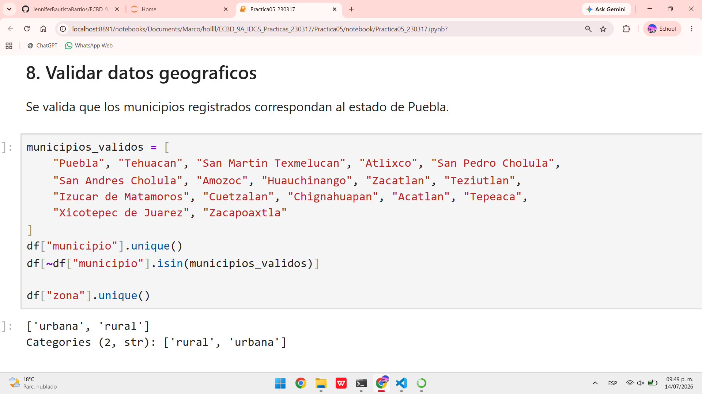

### 9. Realizar limpieza básica de datos
Se imputan los valores nulos de las columnas de laboratorio con la mediana de cada columna, se eliminan duplicados (por fila completa y por `id_paciente`) y se filtran los registros fuera de rango. Tras la limpieza, el dataset conserva sus **5,000 registros y 33 columnas**, confirmando que no se perdió información.

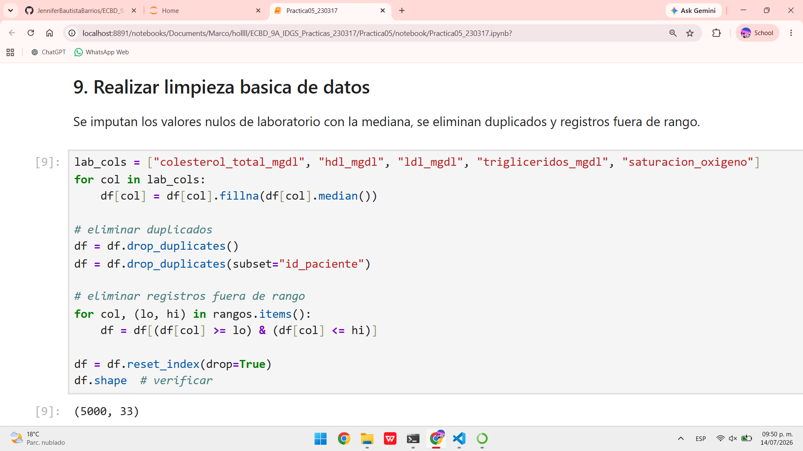

### 10. Realizar análisis estadístico inicial
Se calcula un resumen estadístico descriptivo (media, mediana, mínimo, máximo y desviación estándar) de las variables numéricas. La edad promedio es de **56.38 años**, el IMC promedio es **27.61** (sobrepeso), la presión sistólica promedio es **116.12 mmHg** y el colesterol total promedio es **203.63 mg/dL**, valores consistentes con una población clínica general.

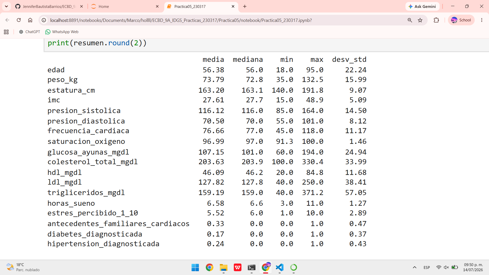

---

## 📊 Visualizaciones EDA

### 11.1 Histogramas de variables clínicas clave
Se generan histogramas con curva de densidad (KDE) para seis variables clínicas: edad, IMC, presión sistólica, glucosa en ayunas, colesterol total y triglicéridos. La edad muestra una distribución bastante uniforme entre los 18 y 95 años, mientras que el resto de las variables clínicas presentan una distribución con sesgo hacia la derecha, concentrada en los rangos normales/moderados y con una cola hacia valores más altos.

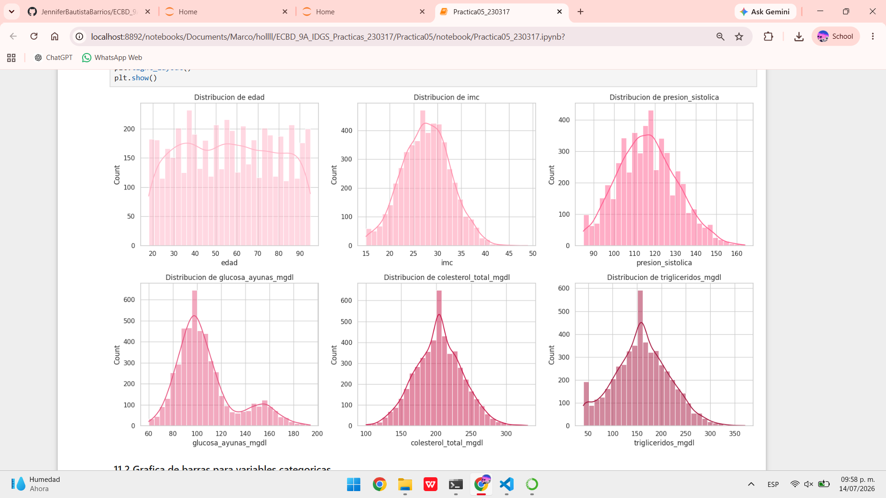

### 11.2 Gráfica de barras para variables categóricas
Se generan cuatro gráficas de barras: distribución por **sexo** (proporciones muy similares entre Femenino y Masculino, alrededor de 2,500 cada uno), distribución por **zona** (mayor concentración en zona urbana, cerca de 3,000 pacientes, frente a 1,800 en zona rural), número de pacientes por **municipio** (Puebla concentra la mayor cantidad, seguido de Tehuacán y San Pedro Cholula) y distribución por **tabaquismo** (predominan los pacientes no fumadores con cerca de 2,700 registros, seguidos de ex fumadores, fumadores ocasionales y fumadores habituales).

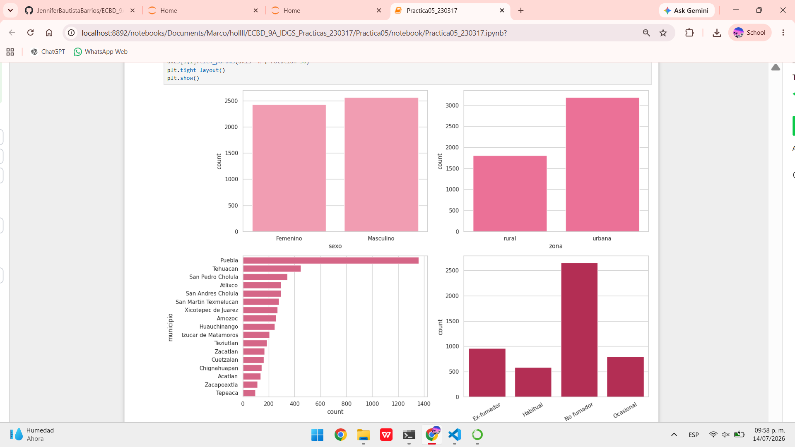

### 11.3 Diagrama de dispersión para relaciones clínicas típicas
Se generan tres diagramas de dispersión coloreados por nivel de riesgo cardiovascular: edad vs. presión sistólica, IMC vs. glucosa en ayunas, y colesterol total vs. triglicéridos. En los tres casos se observa que los pacientes con riesgo **Alto** tienden a agruparse en la zona de valores más elevados de ambas variables, mientras que los de riesgo **Bajo** se concentran en los rangos más normales.

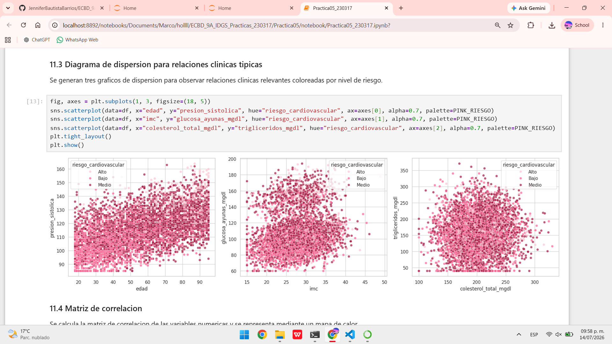

### 11.4 Matriz de correlación
Se calcula la matriz de correlación de las variables numéricas y se representa mediante un mapa de calor en tonos rosas. Se observan correlaciones esperadas, como la relación positiva entre edad y presión arterial, entre peso e IMC, y entre glucosa en ayunas y diabetes diagnosticada, confirmando la coherencia interna de las variables del dataset.

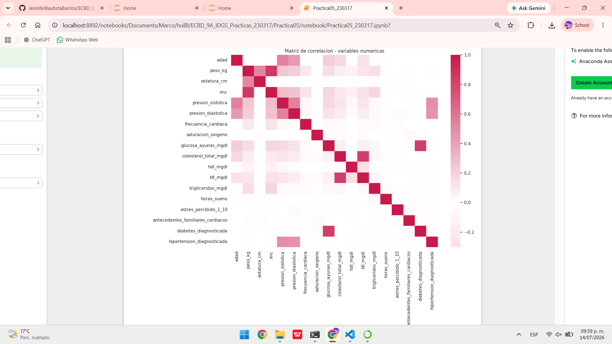

---

## ❤️ Distribución del riesgo cardiovascular

Se genera una gráfica de barras que muestra la cantidad de pacientes en cada nivel de riesgo cardiovascular: aproximadamente **1,800 pacientes** en riesgo **Bajo**, **2,700 pacientes** en riesgo **Medio** y **500 pacientes** en riesgo **Alto**.

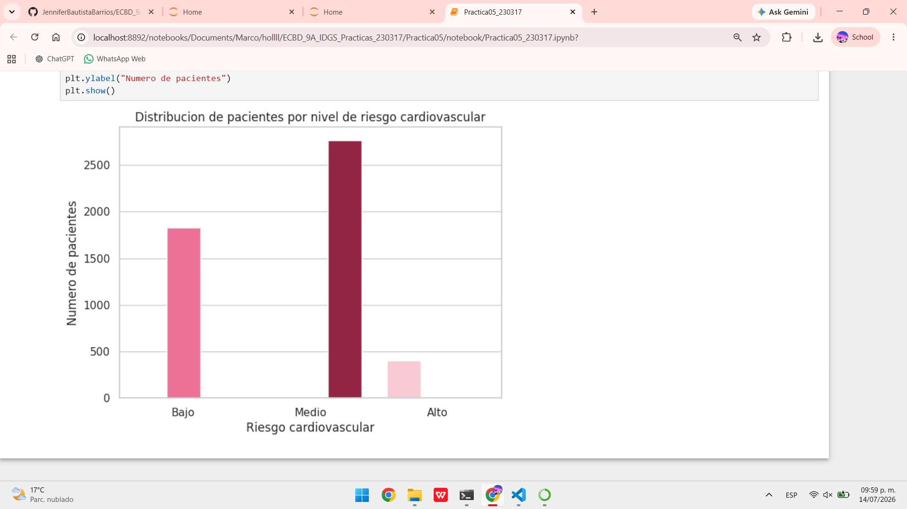

> La variable objetivo `riesgo_cardiovascular` concentra la mayor parte de los pacientes en el nivel **Medio**, seguida por **Bajo** y, en menor proporción, **Alto** — una distribución esperada para una población clínica general simulada, donde los casos de riesgo severo son minoría frente a los de riesgo moderado y controlado.

---

## ✅ Evidencias entregadas

- [x] Dataset simulado en formato CSV con 5,000 registros
- [x] Notebook de Jupyter con validación, verificación y EDA básico
- [x] README documentado con evidencia de cada sección
- [x] Verificación de dimensiones, nombres de columnas, tipos de datos, nulos, duplicados, rangos clínicos y datos geográficos
- [x] Limpieza de datos y análisis estadístico inicial
- [x] Visualizaciones EDA (histogramas, barras, dispersión y matriz de correlación)
- [x] Análisis de la distribución del riesgo cardiovascular

---
*Práctica 05 — Extracción de Conocimiento de Bases de Datos · UTXJ · 2026*

